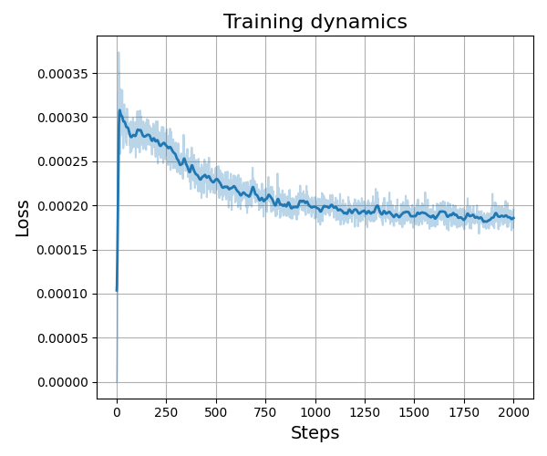
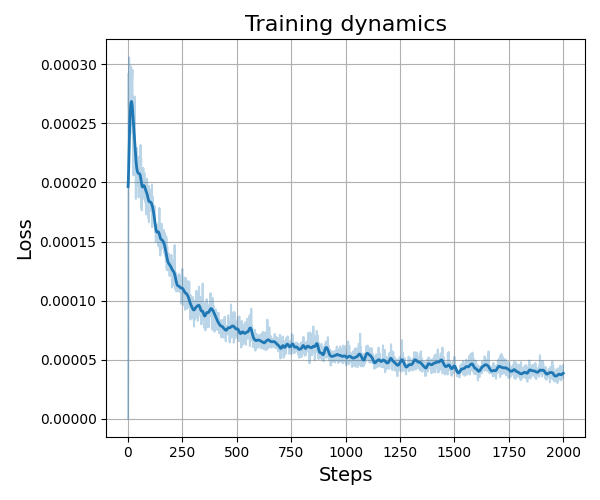
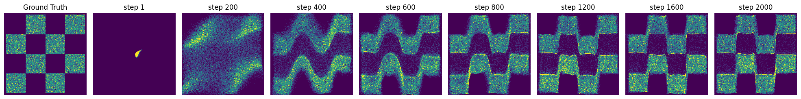
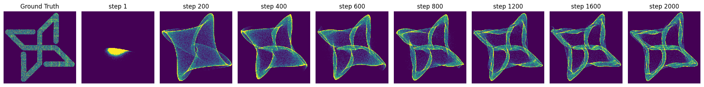

# Learning Drifting (Toy Example)

A minimal implementation of a **drifting-based generative model** on simple 2D toy datasets.

The model learns to transform noise into data by applying a global drift field.

---

## Results

### Losses

<p align="center">
    
    
</p>
<p align="center">
  <sub>
    From left to right: Checkerboard and Logo.
  </sub>
</p>
---

### Training Snapshots

<p align="center">
  <b>Checkerboard</b>
</p>

<p align="center">
  
</p>

<p align="center">
  <b>Logo</b>
</p>

<p align="center">
  
</p>

---

## Overview

- Input: random noise  
- Output: 2D samples matching target distribution  
- Training: drift field computed from interactions between generated and target samples  

---

## Usage

```bash
python src/learning_drifting/train/train_cli.py \
    --dataset checkerboard \
    --iterations 2000 \
    --batch_size 4096 \
    --visualize True